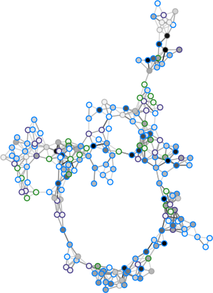

.. Queueing-tool documentation master file, created by
   sphinx-quickstart on Sun Feb  1 14:13:20 2015.
   You can adapt this file completely to your liking, but it should at least
   contain the root `toctree` directive.

Queueing-tool: A network simulator
==================================

Queueing-tool is a simple agent based network simulator. The
`queues <https://en.wikipedia.org/wiki/Queueing_theory>`_
are used to add congestion between nodes.

Getting set up is simple::

    >>> import queueing_tool as qt
    >>> import networkx as nx
    >>> g = qt.generate_random_graph(200, seed=3)
    >>> q = qt.QueueNetwork(g, seed=3)
    >>> q.max_agents = 20000
    >>> q.initialize(100)
    >>> q.simulate(10000)
    ...
    >>> pos = nx.nx_agraph.graphviz_layout(g.to_undirected(), prog='fdp')
    >>> scatter_kwargs = {'s': 30}
    >>> q.draw(pos=pos, scatter_kwargs=scatter_kwargs, bgcolor=[0,0,0,0],
    ...        figsize=(10, 16), fname='fig.png',
    ...        bbox_inches='tight')

.. toctree::
   :maxdepth: 3

   installation
   overview
   modules

Indices and tables
==================

* :ref:`genindex`
* :ref:`modindex`
* :ref:`search`
