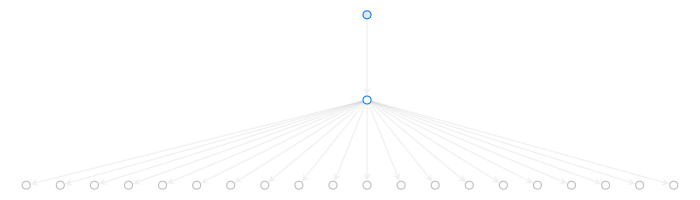
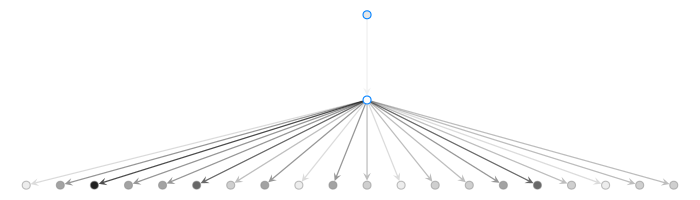

Overview
========

``Queueing-tool`` is an Python simulation package for analysing networks of queues. The simulations are event based, where events are comprised as arrivals and departures of agents. Arrivals from outside the network are simulated as agents, which then move throughout the network from queue to queue. The network is represented as a graph, which is handled by ``graph-tool``\.

There are three major components to ``queueing-tool``: the ``QueueServer`` classes, ``Agent`` classes, and ``QueueNetwork`` classes. The package includes several different types of each class.

1. The :class:`.QueueServer` is the basic part of the package. They have arrivals enter the queue from the outside world and and these arrivals receive service from the queue before moving on. Each queue can have any arrival and service distribution, and these distributions can depend on time. In `Kendall's notation`_, these are :math:`\text{GI}_t/\text{GI}_t/c/\infty/N/\text{FIFO}` queues. There is also a :class:`.LossQueue` class which block arrivals when the queue is at capacity.

2. An ``Agents`` is an objects that moves throughout the network. When an instance of the network is created it starts empty. ``Agents`` are created by a queue and once serviced the ``Agent`` moves on to another queue in the network. Each ``Agent`` *decides* where in the network it wants to arrive at next. An ``Agent`` can also interact with the queues it visits and change the properties of the queue.

3. The ``QueueNetwork`` manages the routing of agents from queue to queue. It can also manage congestion and blocking within the network as well. There are two blocking regimes implemented: blocking after service, and repetitive service blocking. One can also limiting the maximum number of agents within the system for modeling closed networks.

.. _Kendall's notation: http://en.wikipedia.org/wiki/Kendall%27s_notation

The package also contains visualization component, whereby the user can see queueing dynamics in real-time as the simulations take place.

An example
----------

Its probably best to become acquainted with ``queueing-tool`` by way of an example. Suppose you wanted to measure the performance of two queueing systems. The first system, which looks as follows:

Lets model the checkout process of a busy grocery store. People enter the store according to some random process, shop and checkout. They also arrive at greater frequency in the middle of the day. When it's time to checkout you choose your checkout line by searching for the shortest line. You wait in line before receiving service from the checkout counter and when you're done you leave the system.

In ``queueing-tool``, each *person* entering the system is represented as an :class:`.Agent`\. Each ``Agent`` decides how they navigate in the network. In this system an ``Agent`` chooses the shortest queue to enter at whenever they choose which queue to arrive at next. There is already a built-in class of agents that navigate by choosing the shortest queue; this class is the :class:`.GreedyAgent` class.

The network is represented as a graph-tool :class:`~graph_tool.Graph`. On top of each edge in the graph sits the queues, where each queue is represented as a :class:`.QueueServer`. In our model, each checkout line is it's own ``QueueServer``. These checkout queues recieve arrivals from people who are already in the store, not from people outside the store. This means the store serves as its own queue --- it receives arrivals from the neighborhood, and they get funneled into the checkout area. This is a relatively, simple network that is easy create it using ``queueing-tool``.

To create an the network you just need to specify an adjacency list (or adjacency matrix). In our toy example, we are going to assume the store has 20 checkout lines. Let's get started

.. testsetup::

    import graph_tool.all as gt
    import queueing_tool as qt
    import numpy as np

.. doctest::

    >>> import graph_tool.all as gt
    >>> import queueing_tool as qt
    >>> import numpy as np
    >>> adja_list = [[1], [k for k in range(2, 22)]]

Now in our simple system there are three types of queues, the two important ones are: checkout queues, and the queue that represents the store. The third type represents Agents leaving the store and is handled automatically by ``queueing_tool``. To specify what type of queue sits on each edge, you specify an adjacency list like object:

.. doctest::

    >>> edge_list = [[1], [2 for k in range(20)]]

Now we can make our graph

.. doctest::

    >>> g = qt.adjacency2graph(adjacency=adja_list, eType=edge_list)

So we've created a graph where each edge has a type. There is one edge of type ``1``, the store, and 20 edges of type ``2``, the checkout counters. Since our edge of type ``1`` represents the store, it will accepts shoppers from outside the store. We will take the arrival process to be time varying and random (more specifically, we'll let it be a nonhomogeneous Poisson process), with a rate thats sinosoidal. To set that, run:

.. doctest::

    >>> rate  = lambda t: 25 + 350 * np.sin(np.pi * t / 2)**2
    >>> arr_f = lambda t: qt.poisson_random_measure(rate, 375, t)

Lastly, we need to specify the a departure process for each checkout counter. Lets choose the exponential distribution:

.. doctest ::

    >>> ser_f = lambda t: t + np.random.exponential(0.2 / 2.1 )

Now is time to put this all together to make out queueing network. We do this with the following:

.. doctest::

    >>> q_classes = { 0 : qt.NullQueue, 1 : qt.QueueServer, 2 : qt.QueueServer}
    >>> q_args    = { 1 : {'arrival_f'  : arr_f,
    ...                    'service_f'  : lambda t: t,
    ...                    'AgentClass' : qt.GreedyAgent},
    ...               2 : {'nServers'   : 1,
    ...                    'service_f'  : ser_f} }
    >>> qn = qt.QueueNetwork(g=g, q_classes=q_classes, q_args=q_args, seed=13)

For simplicity, we've made it so that when a customer enters the store, they shop ridiculously quickly and then checkout. The default layout was a little hard to discern so I changed it a little:

.. doctest::

    >>> pos = g.new_vertex_property("vector<double>")
    >>> for v in g.vertices() :
    >>>     vi = int(v)
    >>>     if vi == 0 :
    >>>         pos[v] = [0, -0.25]
    >>>     elif vi == 1 :
    >>>         pos[v] = [0, -0.125]
    >>>     else :
    >>>         pos[v] = [-0.5 + (vi - 2) / 20, 0]

To view the model (using this layout), do the following:

.. doctest::

    >>> qn.draw(output="store.png", output_size=(700,200), pos=pos)
    <...>

By default, each :class:`.QueueServer` starts with no arrivals from outside the network and it needs to be initialized before any simulations can run. You can specify which queues are allow arrivals from outside the system with
:class:`QueueNetwork`'s :func:`.initialize` function. In this example, we only want agents arriving from the type ``1`` edge so we run the following code:

.. doctest::

    >>> qn.initialize(eType=1)

To simulate for a specified number of events run.

.. doctest::

    >>> qn.simulate(t=1.8)
    >>> qn.nEvents
    1725
    >>> qn.draw(output="sim.png", output_size=(700,200), pos=pos)
    <...>

If you want to save the arrival, departure, and service start times of arrivals you have to tell it to do so. If we only care about data concerning those exiting the system we can specify that as well

.. doctest::

    >>> qn.collect_data(eType=0)
    >>> qn.simulate(t=1.8)
    >>> data = qn.data_queues(eType=0)
    >>> data.shape
    (309, 5)

See :meth:`.data_queues` and :meth:`.collect_data` for more on extracting data.

