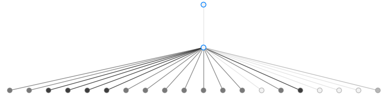

Overview
========

Queueing-tool is a Python simulation package for analyzing networks of queues.
The simulations are event based, where events are comprised as arrivals and
departures of agents that move from queue to queue in the network. The network
is represented as a graph, which is handled by NetworkX.

There are three major components to queueing-tool: the :class:`.QueueServer`
classes, :class:`.Agent` classes, and :class:`.QueueNetwork` class. This package
includes several different types of each class.

1. The :class:`.QueueServer` class is a standard implementation of a
   `waiting line <http://en.wikipedia.org/wiki/Queueing_theory>`_. Its basic
   function is facilitating the arrival of agents --- which arrive with some
   regularity according to some distribution --- and servicing those agents before
   they leave. Each queue can have any arrival and service distribution, and these
   distributions can depend on time. Two such implemented are the following:

    - The :class:`.QueueServer` class can have any positive number of servers
      (including infinitely many). There can also be a maximum number of potential
      arrivals to the queue. In `Kendall's notation`_, these are
      :math:`\text{GI}_t/\text{GI}_t/c/\infty/N/\text{FIFO}` queues.
    - The :class:`.LossQueue` class is an implementation of a
      `finite capacity queue`_\. It has all the features of the :class:`.QueueServer`
      class but also implements blocking (or loss). This class can be used to
      simulate `loss networks`_\. In Kendall's notation, these are
      :math:`\text{GI}_t/\text{GI}_t/c/c+b/N/\text{FIFO}` queues.

2. An :class:`.Agent` is an object that moves throughout the network. When an
   instance of the network is created it starts empty. Agents are created by a
   queue and once serviced the agent moves on to another queue in the network.
   Each agent *decides* where in the network it wants to arrive at next. Two
   examples of the agent implementation are:

    - The :class:`.Agent` class routes itself throughout the network randomly.
      More specifically, when at node ``i`` in the network, the :class:`.Agent`
      decides to transition to node ``j`` with probability :math:`p_{ij}`. The
      user has control over setting the transition probabilities, which can be
      done using the network's :meth:`~.QueueNetwork.set_transitions` method.
    - The :class:`.GreedyAgent` class routes itself by choosing the queue with
      the shortest line.

3. The :class:`.QueueNetwork` class manages the routing of agents from queue to
   queue. It can also manage congestion and blocking within the network. There are
   two blocking regimes implemented:

    - *Blocking After Service*: when an agent attempts to enter a
      :class:`.LossQueue` that is at capacity, the agent is forced to
      wait until an agent departs from that queue.
    - *Repetitive Service Blocking*: when an agent attempts to enter a
      :class:`.LossQueue` that is at capacity, the agent is forced to
      receive another service from its current queue. This process is
      repeated until the agent's desired queue is no longer at capacity.

   One can also limit the maximum number of agents within the system.

.. _loss networks: http://en.wikipedia.org/wiki/Loss_network
.. _finite capacity queue: http://en.wikipedia.org/wiki/M/M/c_queue#Finite_capacity
.. _Kendall's notation: http://en.wikipedia.org/wiki/Kendall%27s_notation

This package also contains a visualization component, whereby the user can see
queueing dynamics in real-time as the simulations take place. See
:meth:`~.QueueNetwork.animate` and :meth:`~.QueueNetwork.draw` for more on
this package's visualization capabilities.

An example
----------

It's probably best to become acquainted with queueing-tool by way of an example.

Let's model the checkout process of a busy grocery store. People enter the store
according to some random process, shop around for some time, and then checkout.
They also arrive at a greater frequency in the middle of the day. When it's time
to checkout, customers choose their checkout line by searching for the shortest
line. They wait in line before receiving service from the checkout counter and
when they're done they leave the store.

In queueing-tool, each *person* entering the system is represented as an
:class:`.Agent`\. Each ``Agent`` decides how they navigate in the network. In
this system an ``Agent`` chooses the shortest queue to enter at whenever they
choose which queue to arrive at next. The :class:`.GreedyAgent` class is built
to model such routing.

The network is represented as a :any:`networkx.DiGraph`. On top of
each edge in the graph sits the queues, where each queue is represented as a
:class:`.QueueServer`. In our model, each checkout line is it's own ``QueueServer``.
These checkout queues receive arrivals from people who are already in the store.
The store receives arrivals from the neighborhood, and after some time they go to
the checkout area. This is a relatively, simple network that is easy to create using
queueing-tool.

To create the network you need to specify an adjacency list (or adjacency
matrix). In our toy example, we are going to assume the store has 20 checkout
lines. Let's get started:

.. testsetup::

    import queueing_tool as qt
    import numpy as np

.. doctest::

    >>> import queueing_tool as qt
    >>> import numpy as np
    >>> adja_list = {0: [1], 1: [k for k in range(2, 22)]}

This says that node 0 points to node one, and node 1 points to nodes 2 through
21. Now in our simple system there are three types of queues, the two important ones
are: checkout queues, and the queue that represents the store shopping area. The
third type represents agents leaving the store and is handled automatically by
``queueing_tool``. To specify what type of queue sits on each edge, you specify
an adjacency list like object::

    >>> edge_list = {0: {1: 1}, 1: {k: 2 for k in range(2, 22)}}

This says there are two main types of queues/edges, type ``1`` and type ``2``.
All the checkout lines are of type ``2`` while the store queue (the edge
connecting vertex zero to vertex one) is type ``1``. The queue that represents
agents leaving the store are type 0 queues, and is handled automatically by
queueing-tool. Now we can make our graph::

    >>> g = qt.adjacency2graph(adjacency=adja_list, edge_type=edge_list)

So we've created a graph where each edge/queue has a type. Since our edge of
type ``1`` represents the store, it will accept shoppers from outside the network.
We will take the arrival process to be time varying and random (more
specifically, we'll let it be a non-homogeneous Poisson process), with a rate
that's sinusoidal. To set that, run::

    >>> def rate(t):
    ...     return 25 + 350 * np.sin(np.pi * t / 2)**2
    >>> def arr_f(t):
    ...     return qt.poisson_random_measure(t, rate, 375)

Lastly, we need to specify the departure process for each checkout counter. Let's
choose the exponential distribution::

    >>> def ser_f(t):
    ...     return t + np.random.exponential(0.2 / 2.1)

Now is time to put this all together to make out queueing network; we do this
with the following::

    >>> q_classes = {1: qt.QueueServer, 2: qt.QueueServer}
    >>> q_args    = {
    ...     1: {
    ...         'arrival_f': arr_f,
    ...         'service_f': lambda t: t,
    ...         'AgentFactory': qt.GreedyAgent
    ...     },
    ...     2: {
    ...         'num_servers': 1,
    ...         'service_f': ser_f
    ...     }
    ... }
    >>> qn = qt.QueueNetwork(g=g, q_classes=q_classes, q_args=q_args, seed=13)

For simplicity, we've made it so that when a customer enters the store they
immediately try to checkout.

The default layout was a little hard on the eyes so I changed it a little::

    >>> qn.g.new_vertex_property('pos')
    >>> pos = {}
    >>> for v in qn.g.nodes():
    ...     if v == 0:
    ...         pos[v] = [0, 0.8]
    ...     elif v == 1:
    ...         pos[v] = [0, 0.4]
    ...     else:
    ...         pos[v] = [-5. + (v - 2.0) / 2, 0]
    ...
    >>> qn.g.set_pos(pos)

To view the model (using this layout), do the following::

    >>> qn.draw(figsize=(12, 3))
    <...>

The network is empty so the edges are light. Use the following code if you want
to save this image to disk::

    >>> qn.draw(fname="store.png", figsize=(12, 3), bbox_inches='tight')

By default, each :class:`.QueueServer` starts with no arrivals from outside the
network and it needs to be initialized before any simulations can run. You can
specify which queues allow arrivals from outside the system with
:class:`QueueNetwork's<.QueueNetwork>` :meth:`~.QueueNetwork.initialize` function.
In this example, we only want agents arriving from the type ``1`` edge so we do the
following::

    >>> qn.initialize(edge_type=1)

To simulate for a specified amount of simulation time run:

.. doctest::

    >>> qn.simulate(t=1.9)
    >>> qn.num_events
    1167
    >>> qn.draw(fname="sim.png", figsize=(12, 3), bbox_inches='tight')
    <...>

The darker edges represent greater congestion at that checkout counter.

If you want to save the arrival, departure, and service start times of arrivals
you have to tell it to do so:

.. doctest::

    >>> qn.start_collecting_data()
    >>> qn.simulate(t=1.8)
    >>> data = qn.get_queue_data()
    >>> data.shape
    (2261, 6)

The above data also include the number of agent in the queue upon arrival to a
queue (this includes the number of agents receiving service and the number of
agents waiting). If we only care about data concerning those exiting the system
we can specify that by having type ``0`` edges collect data:

.. doctest::

    >>> qn.clear_data()
    >>> qn.start_collecting_data(edge_type=0)
    >>> qn.simulate(t=3)
    >>> data = qn.get_queue_data(edge_type=0)
    >>> data.shape
    (575, 6)

The above code collected the departure times of every agent over the simulated
period, it did not collect each agent's arrival or waiting time. See
:meth:`.get_queue_data` and :meth:`.start_collecting_data` for more on extracting data.
